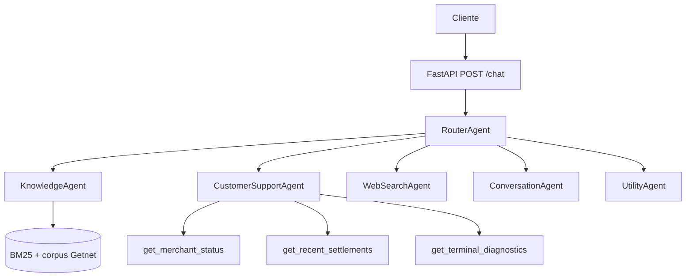

# Getnet Agent Swarm

Sistema multiagente para produtos e suporte Getnet, desenvolvido para o desafio **AI Hardcore
Engineer — Multi-Agent Support System**.

## Arquitetura e orquestração

O `RouterAgent` recebe cada mensagem e delega por chamadas diretas a exatamente um especialista:

1. `KnowledgeAgent`: produtos Getnet fundamentados no RAG local.
2. `CustomerSupportAgent`: contexto privado do lojista por ferramentas controladas.
3. `WebSearchAgent`: perguntas gerais ou atuais com fontes verificáveis.
4. `ConversationAgent`: saudações e feedback sem consultas desnecessárias.
5. `UtilityAgent`: aritmética determinística com árvore sintática restrita.



O Router registra `agent` e `reason` em `routing`, facilitando auditoria. Chamadas diretas deixam o
fluxo pequeno, rápido e testável; uma fila pode substituir essa fronteira sem mudar o contrato HTTP.

## Pipeline RAG

1. **Ingestão:** conteúdo oficial da Getnet é limpo e salvo em blocos `.txt` versionados.
2. **Armazenamento:** os blocos e suas URLs de origem ficam em `data/`.
3. **Recuperação:** tokenização, sinônimos e BM25 selecionam até três trechos.
4. **Geração:** o Knowledge Agent responde somente com contexto recuperado ou política explícita.

Fontes iniciais: [maquininhas](https://site.getnet.com.br/maquininha/get-smart/),
[Pix](https://site.getnet.com.br/pix/), [Link de Pagamento](https://site.getnet.com.br/link-de-pagamento/)
e [antecipação](https://site.getnet.com.br/get-ajuda-antecipacao-de-venda/como-antecipar-sua-vendas-pelo-app/).
Um job de produção deve atualizar os documentos, validar mudanças e reconstruir o índice.

## API

```http
POST /chat
Content-Type: application/json

{"message":"What's the difference between Get Clássica and Get Smart?","user_id":"cliente1988"}
```

A resposta contém `agent`, `answer`, `sources`, `needs_human` e `routing`. Swagger: `/docs`.

## Configurar e executar

Requer Python 3.12+.

```powershell
python -m venv .venv
.venv\Scripts\pip install -r requirements.txt
.venv\Scripts\uvicorn app.main:app --reload
```

Chat: `http://localhost:8000/`. Apresentação: `/apresentacao`. Avaliação: `/avaliacao`.

## Docker

```bash
docker build -t getnet-agent-swarm .
docker run --rm -p 8000:8000 getnet-agent-swarm
```

## Testes

```powershell
pip install -r requirements-dev.txt
ruff check .
pytest -q
```

A suíte cobre os cenários fornecidos: Get Clássica versus Smart, Pix, antecipação, Link de
Pagamento, crediário, conectividade, transação recusada, liquidação, clima e câmbio. Testes de
integração em produção devem usar contratos para APIs Getnet, falhas simuladas, timeouts, carga,
prompt injection e um conjunto de avaliação versionado.

## Guardrails, confiabilidade e observabilidade

- Conhecimento de produto só responde com corpus aprovado e fontes.
- Dados privados nunca seguem para busca pública; ferramentas retornam o mínimo necessário.
- Nenhuma senha, PIN, código ou dado completo de cartão é solicitado ou exposto.
- `needs_human` aciona handoff quando cadastro ou diagnóstico indica falha.
- Busca atual não inventa fatos quando provedores estão indisponíveis.
- Roteamento e fontes são estruturados para logs, métricas de latência e tracing.

Em produção, acompanhar taxa de roteamento correto, groundedness, resolução, handoffs, latência,
erros por ferramenta e custo. Alertar sobre aumento de respostas sem fonte ou falhas consecutivas.

## Decisões e limitações

As ferramentas de cliente são mocks intencionais porque não há credenciais Getnet no desafio.
Devem ser substituídas por APIs autenticadas, auditadas e com controle de acesso. O mecanismo local
é determinístico para tornar a avaliação reprodutível; os prompts em `prompts/` documentam como um
LLM pode ser conectado sem alterar os contratos dos agentes.
